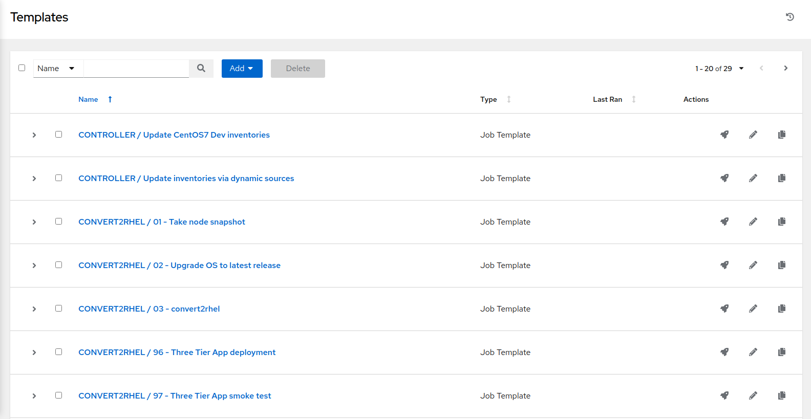
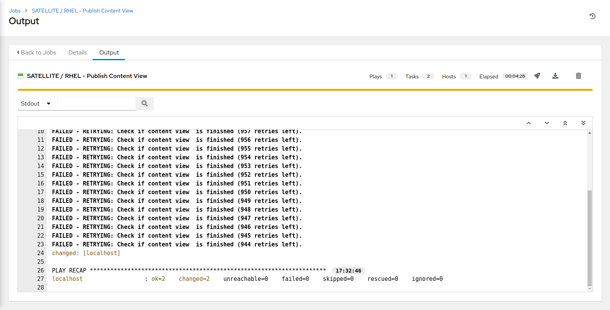
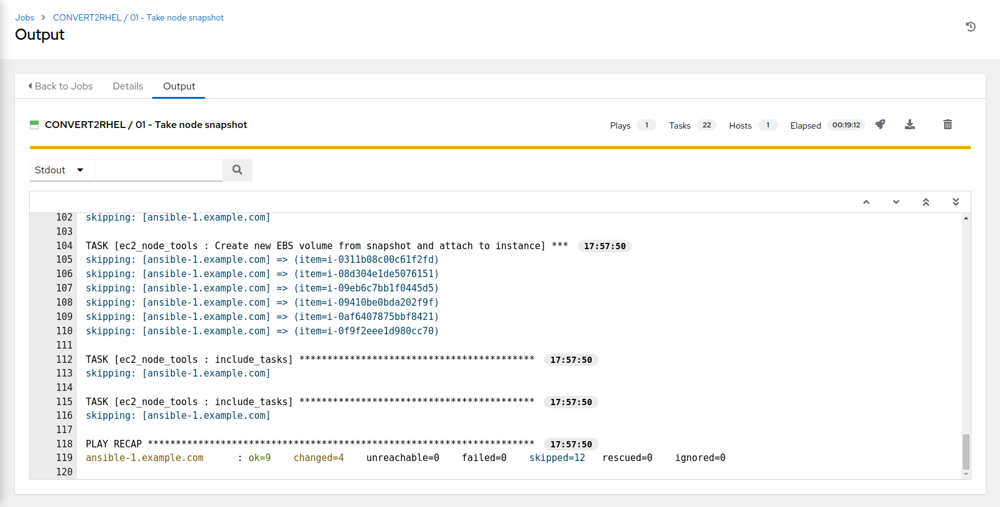
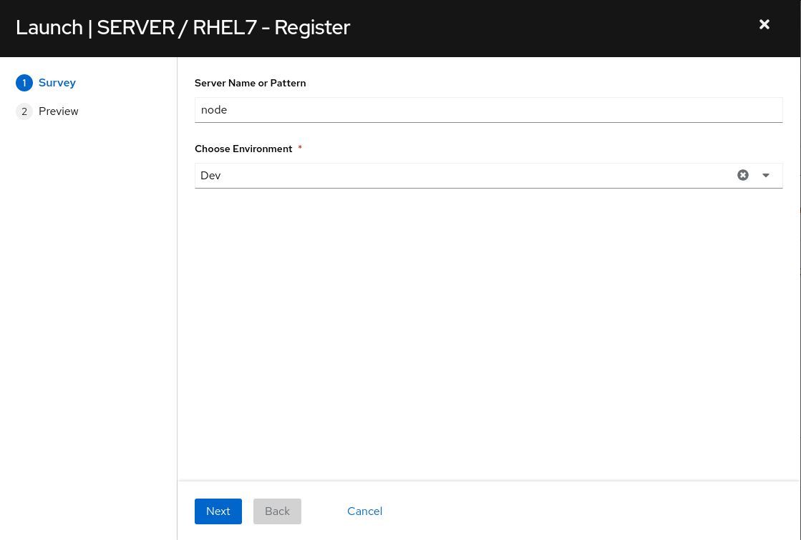
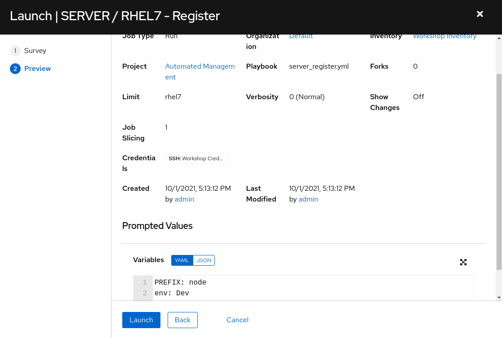
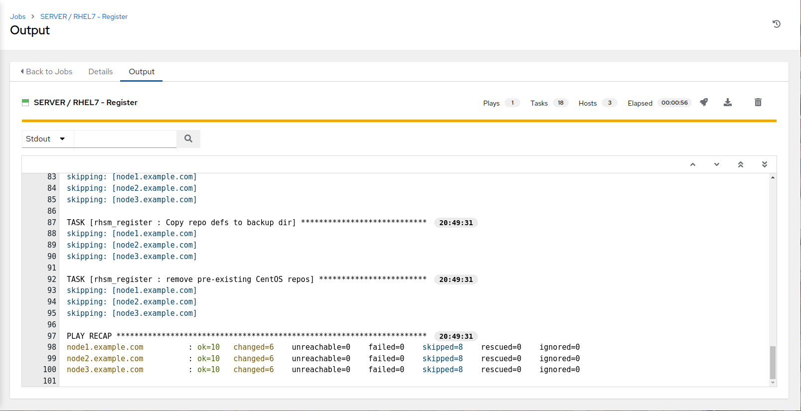
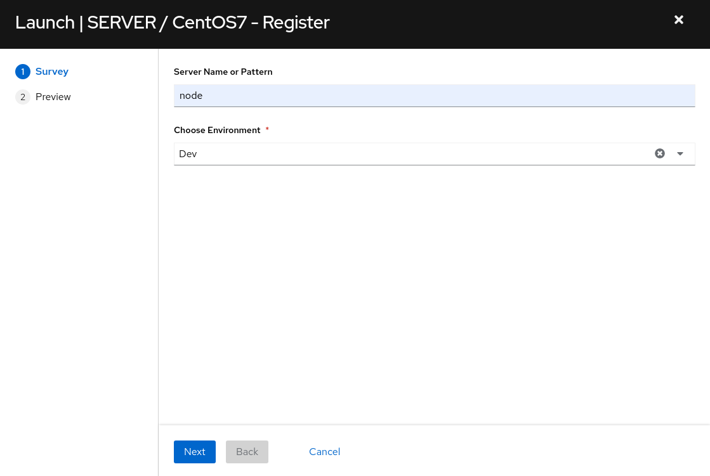
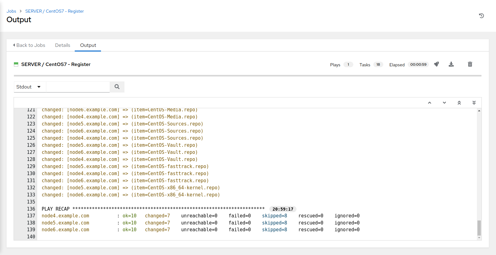
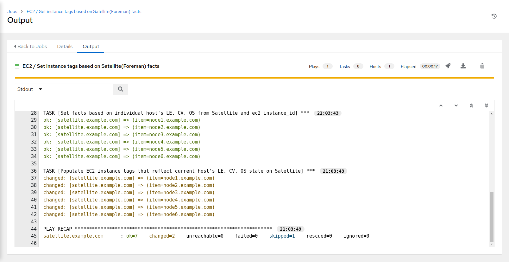
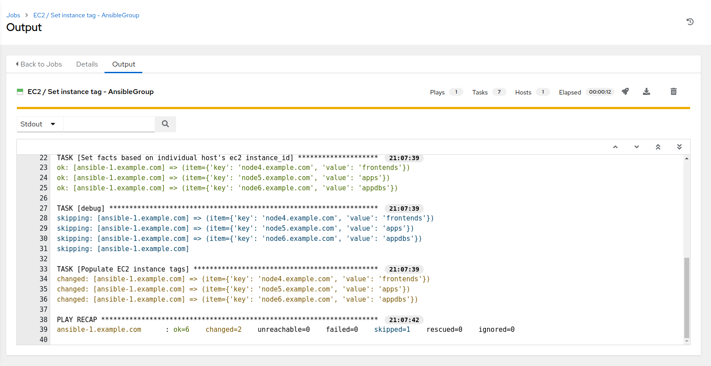

Integrated Management Workshop: Configuring the Lab Environment
==============================================================

Objective
---------
The objective of this exercise is to setup the lab environemnt. This exercise will require you to launch (5) playbooks. The playbooks accomplish the following:

-   Setup and configure Satellite with the proper lifecycle environments, content views, activation keys.
-   Populate Ansible Controller with an inventory source, add templates, as well as an additional project.
-   Publish RHEL7 dev content view in Satellite 
-   Register servers to the Satellite installation - RHEL7
-   Register servers to the Satellite installation - CentOS7

Environment
---------
* Ansible Automation Platform URL<br>
    * *Example: https://student1.smrtmgmt013.mw01.redhatpartnertech.net*
* Ansible Automation Platform login/password 
* Satellite URL<br> 
    * *Example: https://student1-sat.smrtmgmt013.mw01.redhatpartnertech.net (Note the -sat added to the URL)*
* Satellite login/password (same as above)

Exercise
--------

#### 1\. Logging into the Ansible Automation Platform (AAP)

-   Use a web browser on your computer to access the AAP GUI via the link found in the Environment above. And use the following username and password to login: *admin / <password_set_in_deploy_vars>* 


-   Upon successful login, you will be able to see the Ansible Automation Platform dashboard.

-   Use the side pane menu on the left to select **Projects** and review the two projects named **Automated Management** and **Fact Scan**. These projects, along with the Workshop Inventory (**Inventories** -> **Workshop Inventory**) have been set up for you during the provisioning of the lab environment.

#### 2\. Launch Ansible job templates

This step demonstrates the execution of job templates. You will be working with various templates as the workshop progresses, however, this step utilizes seven templates to initialize the lab environment configuration.

-   Use the side pane menu on the left to select **Templates**.

-   Initially, you should see two **Templates** named **SETUP / Satellite** and **SETUP / Controller**.


-   Click to launch the **SETUP / Satellite** job. When prompted, be sure to change ```refresh_satellite_manifest: false```  to  ```refresh_satellite_manifest: true``` and click **Next**. Verify the change, then click **Launch**.


You will be taken to the **Jobs > SETUP / Satellite** dashboard where you will be able to follow each task executed as part of the playbook. This will take approximately 35 mins to complete.

> **NOTE** Please allow the **SETUP / Satellite** job to run to completion before proceeding to execution of the next template.


When complete, you will see a successful status as well as a play recap at the bottom of the screen.

Next you will need to run the **SETUP / Controller** job template. 

-   Select **Templates** and click on theto the right of the **SETUP / Controller** job template.


-   Navigate back to **Templates** on the left side pane.

The **SETUP / Controller** job will create multiple job templates that will be useful throughout the remainder of this workshop. 



Now that we have several more templates at our disposal we will need to run four more of these in order to complete setup.

Run the **SATELLITE / RHEL - Publish Content View** job template by clicking theto launch. When prompted by the survey for the content view to publish, from the drop down menu, select **RHEL7**
-   Select **Next** to review the setting for the job run, then click **Launch** the run the job template.



Next, run the **CONVERT2RHEL / 01 - Take node snapshot** job template by clicking theto launch.



Next, run the **SERVER / RHEL7 - Register** job template by clicking theto launch.

-   You will be presented with a survey. Fill this out as follows:



-   Select **Next** to proceed to the survey response confirmation.



-   Select **Launch** to run the job template.



Run the **SERVER / CentOS7 - Register** job template by clicking theto launch.

-   You will be presented with a survey. Fill this out as follows:



-   Select **Next** to proceed to the survey response confirmation.


-   Select **Launch** to run the job template.



Run the **EC2 / Set instance tags based on Satellite(Foreman) facts** job template by clicking theto launch.



> **NOTE** For the following job template, review the **Variables** section of the template, paying particular note to the **group_tag_map** variable.  A mapping of nodes to group names is defined.  EC2 tags for these group names will be assigned to the nodes defined and this will be utilized later via dynamic inventory building to construct Ansible inventory groups containing the nodes defined, ie. "frontends", "apps", "appdbs".

Next, run the **EC2 / Set instance tag - AnsibleGroup** job template by clicking theto launch.



Dynamic inventories - understanding inventories populated via dynamic sources
------------

> **NOTE** Before running the dynamic inventory update templates in the upcoming steps, first navigate to the Inventories location in AAP and review the following inventories:
>
>     - ALL Development => HOSTS
>     - CentOS7 Development => HOSTS
>     - RHEL7 Development => HOSTS
>      
>    Note that these inventories have yet to be populated.  Also, while you are in each of these inventories, click on the "SOURCES" button and review how each of these dynamic source inventories are configured, taking note of the "SOURCE VARIABLES" section to gain an understanding on how the resultant hosts and groups for that particular inventory are populated.

Run the **CONTROLLER / Update inventories via dynamic sources** job template by clicking theto launch.

-   You will be presented with a survey. Fill this out as follows:


-   Select **Next** to proceed to the survey response confirmation.

-   Review Extra Variables, then select **Launch** to run the job template.

Run the **CONTROLLER / Update inventories via dynamic sources** job template by clicking theto launch.

-   You will be presented with a survey. Fill this out as follows:


-   Select **Next** to proceed to the survey response confirmation.

-   Review Extra Variables, then select **Launch** to run the job template..

Dynamic inventories - review inventories populated via dynamic sources
------------

> **NOTE** Now that the dynamic inventory update templates have been executed, navigate to the Inventories location in AAP and review the following inventories:
>     - ALL Development => HOSTS
>     - CentOS7 Development => HOSTS
>     - RHEL7 Development => HOSTS
>      
>    Review how the resultant hosts and groups are defined from information based on tags set from earlier Satellite job template queries.

Next, login to Satellite to perform verification.

#### 3\. Login to Satellite and validate your Environment

 

-   Use a web browser on your computer to access the Satellite GUI via the link found in the Environment above. And use the following username and password to login: *admin / <password_set_in_deploy_vars>*. Once you have logged in you will see the main Monitor page.

-   Click on **Hosts** -> **All Hosts** to validate that three RHEL7 and three CentOS7 server nodes are registered to Satellite. 


-   Click on **Content** -> **Content Views** -> **RHEL7** to verify that all Dev, QA and Prod environments are accounted for.


#### 4\. End of exercise

-   You have finished this exercise
-   Continue to [Exercise 1: Compliance / Vulnerability Management](https://github.com/redhat-partner-tech/partner-tech-days-march2021/blob/main/integrated-mgmt-workshop/exercises/1-compliance/openscap-exercise.md), OR [Return to the main workshop page](https://github.com/redhat-partner-tech/partner-tech-days-march2021/tree/main/integrated-mgmt-workshop)
